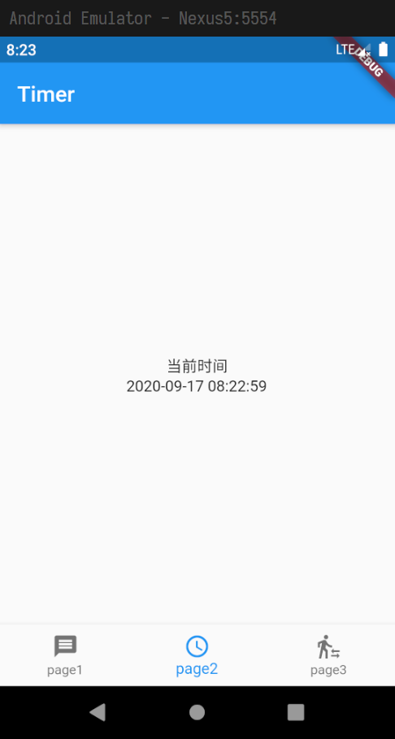

> 打开本文件有困难 或 阅读时无格式, 建议安装 **Typora**.

# Flutter入门培训

## 〇. 前言

Flutter 是 Google 开源的 UI 工具包, 帮助开发者通过一套代码库高效构建多平台精美应用, 支持移动、Web、桌面和嵌入式平台. Flutter 使用 Dart 语言进行开发.

国内业内最为著名的使用案例是阿里闲鱼的 原生/Flutter 混合开发.

现今的 Flutter 在国内环境下是一个处于发展期的语言, 相关的资料和案例以**问答、文档、博文和代码的形式**给出较多, 线性教程 (*线性教程指包揽"从入门到精通"的教程*) 数量少且质量低, 所谓实战其实是玩具, 不是很推荐.

这种情况可能不能迎合某些开发者所习惯的基于线性教程的通用学习方法, 他们需要改变在Flutter上的学习思路 -- 变成一个离散化的、**时刻从查阅资料中获取知识**的学习者, 或者考虑**在国外环境中寻找线性教程**. 如果你十分依赖视频教程, 也许去Google、YouTube而不是Bilibili或百度网盘, 收获会更大.

## 一. 环境安装

### 1. 墙外环境

**任何一个程序员都应该时常处于或有能力在必要时处于墙外环境下**, 结合Flutter开发, 具体原因如下:

2. Flutter和Dart相关的许多网站(包括[Flutter官网](http://flutter.dev/))都处于被屏蔽的状态, 这将给开发和资料获取带来肉眼可见的困难.
2. 下载Android SDK和其它配套资源使用的Google服务器, 以及Android Studio和IntelliJ IDEA的插件服务器, 在国内环境下都不太稳定, 速度慢且容易下载失败.
3. [github.io](https://www.github.io)处于被屏蔽状态, 而[github](https://github.com)、[stackoverflow](https://stackoverflow.com/)等网站连接速度很慢, 这对所有程序员来讲都是很大的阻碍. 尤其针对到了Flutter这种资料驱动型的新技术.
4. 在墙外还可以通过Google和YouTube来获取其他语种开发者所拥有的更多资源, 比孤立的中文环境丰富不少.

结论: **强烈建议在墙外环境学习和使用Flutter**. 这需要网络代理相关知识, 在部分软件中需要手动配置代理.

### 2. 安装Flutter SDK

参考网上任意教程, 安装Flutter SDK, 使用`flutter doctor`命令检查安装状态

推荐跟随文档[^Flutter官方文档]进行安装, 推荐使用统一的Flutter版本: **1.20.4**

### 3. 熟悉IDE

Flutter和Dart应用程序, 推荐使用 **IntelliJ IDEA** 或 **Visual Studio Code** 或 **Android Studio** 进行开发

**熟悉以上至少一款IDE, 并安装Flutter和Dart插件**

### 4. 配置IDE插件

1. 指定Flutter SDK目录, 你自己安的我不知道在哪, 略.

2. 指定Dart SDK目录 (这一步与许多课程中所讲的安装Dart SDK不同, 请务必注意)

	Flutter SDK中默认自带了Dart SDK, 因此无需单独安装, 路径为:
	
	`<Flutter SDK目录>/bin/cache/dart-sdk`

有些IDE不会在一开始要求这些配置, 这时尽力寻找配置项即可, 实在找不到等遇到再配也不迟.

## 二. 学习Dart语言

*Dart(在目前情况下)可以理解为专为Flutter打造的语言, 因此大部分文档和课程也都是与Flutter绑定的*

### 1. 跟随学习资料入门语言基础

> 请注意, **只学习Dart语言部分**, 并略过SDK环境配置(已在上一步完成)
>
> 视频可以酌情加速, 与其他语言重复的或已经熟练的部分可以直接快进, **不要在这里花费太多时间**
>
> **遇到问题时, 请及时查阅文档[^Dart语言开发文档]或搜索相关内容**

**文档教程**:

- [Flutter整理的Dart教程列表](https://flutter.cn/docs/resources/bootstrap-into-dart)
- Dart语言开发文档[^Dart语言开发文档] (跟Flutter整理的是一回事)

**三个网课**, 酌情互补观看(讲的并不全, 只适合入门):

- [千峰](https://www.bilibili.com/video/BV1M5411Y77N)
- [coderwhy](https://www.bilibili.com/video/BV1KE41117XV)
- [IT营](https://www.bilibili.com/video/BV1S4411E7LY)

### 2. 编写自己的Dart命令行程序

请循序渐进完成以下三个任务(也可自拟难度和目的相似的任务进行替换):

- [ ] 一个简单的Hello程序
- [ ] 一个简单的时钟
- [ ] 一棵二叉树

#### (1) 一个简单的Hello程序

- 此任务的目的是强制学习IDE配置, 同时复习程序执行的基础知识.

通过**命令行参数**传递一个英文字符串, 程序打印出**单词首字母大写, 其余字母小写**的字符串`Hello <arg>.`

比如在cmd中执行:

```shell
dart main.dart douDOU
```

程序将打印出:

```
Hello Doudou.
```

> 实际做的时候, 命令行参数要在**IDE的运行选项中配置**, 不要手动cmd.

#### (2) 一个简单的时钟

- 此任务的目的, 一是在一定程度上熟悉字符串, 时间/时间间隔, 并培养查阅资料的能力; 二是练习简易的Dart面向对象编程技巧.

每秒输出一次当前时间, 输出一分钟后自动结束.

要求**使用扩展(即继承)自DateTime的自定义类**来实现获取当前时间并构造格式化的字符串的功能, 要求的格式为: `"yyyy-MM-dd[空格]HH:mm:ss"`, 不需要转换时区.

示例输出如下:

```dart
2020-09-16 19:59:03
2020-09-16 19:59:04
2020-09-16 19:59:05
2020-09-16 19:59:06
2020-09-16 19:59:07
...
```

> Dart中实现的DateTime类, **除ISO时间格式字符串外, 没有提供任何时间格式化为字符串的功能**, 请参考相关资料自行实现.

#### (3) 一棵二叉树

- 此任务的目的是强制熟悉Dart特有的语法规则和数据类型, 语法规则如扩展构造函数、命名参数、getter/setter、泛型等, 数据类型如List、自定义类等; 同时二叉树构造和遍历也作为编程能力的练习.

读取一颗二叉树的先序和中序遍历序列(节点编号), 输出其后序遍历序列和层次遍历序列.

要求**封装为二叉树类`BinTree`, 在扩展构造函数`BinTree.ordered({List<int> preOrdered, List<int> inOrdered})`中传递先序和中序遍历序列, 在类内getter方法`List<int> get PostOrdered`中导出后序遍历序列, 导出层次遍历序列也类似**.

我们约定节点编号是**连续的正整数**, 并且**不超过100个**.

示例代码:

```dart
class BinTree {
  // TODO: 写你的代码
}

void main(List arguments) {
  var tree = BinTree.ordered(
    preOrdered: <int>[1, 2, 4, 7, 10, 5, 8, 3, 6, 9],
    inOrdered: <int>[4, 7, 10, 2, 8, 5, 1, 3, 9, 6],
  );
  print(tree.postOrdered);
  print(tree.layerOrdered);
}
```

示例输出:

```dart
[10, 7, 4, 8, 5, 2, 9, 6, 3, 1]
[1, 2, 3, 4, 5, 6, 7, 8, 9, 10]
```

> 我可没说只有BinTree这一个类...

## 三. 学习Flutter

### 1. 跟随学习资料入门Flutter开发

**网课**:

- [Flutter实战(电子书)](https://book.flutterchina.club/)
- [coderwhy](https://www.bilibili.com/video/BV1KE41117XV?p=32) (和Dart是同一个)
- [IT营](https://www.bilibili.com/video/BV1S4411E7LY) (和Dart是同一个)

**Flutter官方内容**:

- Flutter官方文档[^Flutter官方文档] (初学者仅阅读`开发文档-用户界面`部分即可)
- [Flutter官方组件介绍](https://www.bilibili.com/video/av38437526) (略览即可)
- Flutter和Dart官方API文档[^Flutter和Dart官方API文档] (作为参考资料使用)
- [Flutter介绍视频](https://cn.udacity.com/course/build-native-mobile-apps-with-flutter--ud905) (默认中英双字幕, 可切换至仅中文, 讲解速度较快, 需要翻墙)

**Flutter社区内容**:

- [思否Flutter专栏](https://segmentfault.com/t/flutter/blogs)
- [知乎Flutter专栏](https://www.zhihu.com/topic/20172123/top-answers)
- [简书Flutter专栏](https://www.jianshu.com/c/ebc9d2e84214)
- [掘金Flutter专栏](https://juejin.im/tag/Flutter)
- [Stackoverflow Flutter标签](https://stackoverflow.com/questions/tagged/flutter?tab=Votes)

**优质资源**:

- [Flutter完整实战详解(掘金)](Flutter 完整实战详解)
- [闲鱼技术的文章(掘金)](https://juejin.im/user/1257497031878408/posts)
- [开源框架、项目和学习资料汇总](http://www.cocoachina.com/cms/wap.php?action=article&id=25856) (大多为英文, 内部链接需要翻墙)

> 官方文档[^Flutter官方文档]中提供了许多Flutter的使用建议, 这套文档大部分是以用例进行分类整理的, 适合稍有基础的开发者拓展视野. 尤其是[此页](https://flutter.cn/docs/cookbook).

### 2. 编写自己的Flutter应用程序

请循序渐进完成以下七个任务(也可自拟难度和目的相似的任务进行替换):

- [ ] 一个简单的Hello程序
- [ ] 一个可切换的导航栏
- [ ] 一个简单的时钟
- [ ] 一个真正的Hello程序
- [ ] [可选]一棵二叉树
- [ ] 一个登陆界面
- [ ] 打包安卓应用

#### (1) 一个简单的Hello程序

- 此任务的目的是学习无状态组件的用法, 并理清Dart和Flutter的关系.

程序在一个Text组件中显示出包含一个随机数`rand∈[0,1000)`的字符串`Hello <rand>.`

示例界面如下:


#### (2) 一个可切换的导航栏

- 此任务的目的是: 了解有状态组件, 并实现导航栏交互, 顺便练习Flutter自带Widget的使用.

首先在lib目录下建立三个页面(三个dart文件), 名称分别为`page1-3.dart`. 再建立一个dart文件, 名称为`myPageI.dart`, 在`myPageI.dart`中创建一个抽象类(接口)继承自`Widget`(为什么要继承? 自己去掉试试就明白了):

```dart
abstract class MyPageI extends Widget {
  AppBar get appBar;
}
```

将Hello程序相关的内容抽离到`page1.dart`的`Page1`类中, 并在`main.dart`中引用. `Page1`类是一个**继承自`StatelessWidget`**, **实现了`MyPageI`接口**的类, 如下:

```dart
class Page1 extends StatelessWidget implements MyPageI {
  @override // 这里重写的是MyPageI
  AppBar get appBar => AppBar(title: Text('Hello'));

  @override // 这里重写的是StatelessWidget
  Widget build(BuildContext context) {
    // Your code...
  }
}
```

最终要求`main.dart`形成如下结构:

```dart
void main() {
  runApp(MyApp());
}

class MyApp extends StatelessWidget {
  @override
  Widget build(BuildContext context) {
    return MaterialApp(
      title: 'MyDemo',
      home: MyHomePage(),
    );
  }
}

class MyHomePage extends StatelessWidget {
  var page = Page1();      // 👈 注意这里
  @override
  Widget build(BuildContext context) {
    return Scaffold(
      appBar: page.appBar, // 👈 注意这里
      body: page,          // 👈 注意这里
    );
  }
}
```

接下来, 仿照`page1.dart`, 为`page2.dart`和`page3.dart`随意填充两个无状态组件, 分别命名为`Page2`和`Page3`. 将`main.dart`中的`MyHomePage`组件**更改为有状态的`StatefulWidget`**.

在新的`MyHomePage`的`State`类中添加两个私有属性: **`List<MyPageI> _pages=[Page1(), Page2(), Page3()]` 和 `int _active=0`**, **将`Scaffold`中的`appBar`和`body`替换为与这两个属性相关联的实现**.

给`Scaffold`的构造函数传入**`BottomNavigationBar`参数**, 构建一个导航栏, 并在适当时机(`onTap`时)**调用`setState()`方法**, 最终实现导航栏点按切换页面的功能.

示例界面如下:


> 如遇到困难, 请寻找相关网课或资料自行学习.

#### (3) 一个简单的时钟

- 此任务的目的是: 掌握Timer类, 了解Dart语言中"异步"的真相, 进一步学习有状态组件.

在一个Text组件中, 每秒输出一次当前时间, 不需要停止. 时间格式要求与Dart练习中的要求相同.

此任务即为`Page2`, 现在你可以把上一个任务中随意填充的代码清理一下了.

示例界面如下:



> 以下内容是思路拓展:
>
> 首先排除在程序内直接写一个死循环, 这会导致宕机. 但不断更新文本本身就是一个死循环, 该怎么办呢? 一种答案是使用"异步".
>
> Dart虽然有Future, async/await等异步语法, 但与大多数语言"多线程/协程"式的异步不同.
>
> Dart使用的是单线程的事件队列, 每一个异步操作, 都是一个事件, 比如点击事件/滑动事件/还有你自己定义的Future. 这些事件可以以任意的顺序入队, 但是一旦入队, 就必然是顺序执行的, 一个执行完才轮到下一个. 在不了解的情况下使用容易出现问题, 尤其是误以为每个Future间是"并行"的 -- 实际上是"串行"的.
>
> 一句话来概括: **Dart可以异步(不确定执行顺序), 但是异步中没有并发(同时执行多个)**. 详情请参考[这篇文章](https://www.jianshu.com/p/a4affde4c8ca)
>
> 这也就意味着, 哪怕开了一个异步事件, 在异步事件中死循环也是不行的, 这会阻塞掉它之后的所有其他事件.
>
> 我们可以使用一个**函数的无限自我调用(类似递归)**来规避这个问题. 在这样的实现中, 每一次函数调用都是新的事件, 虽然一直在循环, 但却没有永远抢占事件队列. 如下所示:
>
> ```dart
> MyDateTime now;
> startRefresh() {
>   setState(() {
>     now = new MyDateTime();
>   });
>   sleep(Duration(milliseconds: 200));
>   Future(startRefresh); // 在一个新事件中再次执行本函数(注意前面已经给过延迟了)
> }
> @override
> void initState() { // 重写State的初始化方法, 把这个无尽循环塞进去
>   startRefresh();
>   super.initState();
> }
> ```
>
> 到这里我们应该已经成功实现了计时功能. 但是有一个值得考虑的问题: sleep同样也会产生阻塞, 在本例中的200ms sleep进行时, 该事件并不出队, 其他的事件(例如点击)是无法及时响应的. 假设这个延迟达到了1s, 就无法忍受了.
>
> 另外还有一个致命的问题, 来自于我们的设计 -- 这个递归没有出口! 这在应用主界面上是无所谓的, 但如果这是一个子界面, **无尽的循环将导致相关组件的生命周期出现不可预测问题**, 这是需要注意的.
>
> -----
>
> 因此我们考虑用一个现有的、完整贴合系统时钟的、生命周期安全的新方法, 替代这种纯手工的异步操作:
>
> **使用`Timer`类, 相比自己实现异步控制方便了很多, 同时这也是今后经常遇到的定时任务的良好解决方案.** 至于如何编写代码实现功能, 请自行学习.
>
> -----
>
> 题外话: Dart是拥有并行机制的, 但和这里讨论的异步是两个东西. 它的名字叫`Isolate`.

#### (4) 一个真正的Hello程序

- 此任务的目的是练习事件处理和用户交互, 进一步熟悉有状态组件.

在第一个任务中, 我们写了一个静态的Hello程序, 它在每次加载时生成一个随机数, 然后组装成静态文本显示在画面中. 我们能否像在Dart命令行里一样, 任意指定一个像`Hello xxx.`这样的输出呢?

使用一个输入框(`TextField`)来捕获用户的输入, 并且在输入后及时更新Text内显示的文本. 注意, 依然要保证**首字母大写, 其余字母小写**. 在原有的`Page1`基础上继续修缮即可.

示例界面如下:


> 参考[此教程](https://www.jianshu.com/p/56695d4cbf17).

#### (5) [可选]一棵二叉树

- 此任务的目的是练习Canvas图形渲染, 并增强字符串处理能力, 练习表单处理, 更深入地了解Flutter组件机制.

将Dart练习中的二叉树移植到Flutter来, 做图形化, 放入`Page3`.

使用两个输入框(`TextField`)来捕获用户的输入, 分别代表先序遍历序列和中序遍历序列(输入格式自拟, 比如我用的是空格分隔), 在输入框更新后立即生成一个用Canvas绘制的二叉树图形, 如果生成失败, 则令图形保持不变, 等待下一次输入. 我们约定节点编号$node_i \in [1,8) \cap Z$.

示例界面如下:


> 提示0: 可以使用[此教程](https://www.jianshu.com/p/7405157f7546)入门Canvas, [此教程](https://www.jianshu.com/p/8a3bdd37037e)绘制文本. 当然不够, 还需要自己去摸索.
>
> 提示1: 自定义一个Painter的构造函数, 即可告诉这个Painter他应该画哪些点.
>
> 提示2: 一条线是否显示, 直接取决于他所连接的子节点是否显示.
>
> -----
>
> 实际业务中, 用户可以任意输入乱七八糟的东西, 你需要为用户输入的字符串进行负责任的检查 -- 或者直接限定他们能输入的字符 -- 但是最终也需要检查.

#### (6) 一个登陆界面

- 此任务的目的是: 练习项目结构规划, 练习朴素的组件间状态传递, 练习表单处理.

给我们的APP添加一个登陆界面, 对应文件`login.dart`, 只有用户名为`doudou`, 密码为`123456`的用户可以**登陆进入主界面**, 否则停留在登陆界面上. 本任务不强制要求实现登陆状态驻留, 也不要求注销功能, 可以每次重启应用时重新登陆.

示例界面如下(样式自拟):


> 提示0: 可以保持MyHomePage不变, 在MyApp里多封装一些东西...
>
> 提示1: 参考[此教程](https://www.jianshu.com/p/56695d4cbf17)进行表单搭建和处理, 参考[此教程]()了解如何让组件之间互call(在这里应该使用回调函数从子组件向父组件传递消息).

#### (7) 打包安卓应用

最后, 把我们的APP Release一波

可以将生成的APK放在自己手机上跑一跑.

> 打包请参考 [此教程](https://flutterchina.club/android-release/) 和 [此教程](https://www.jianshu.com/p/749baa589d6c) 和 [此教程](https://www.cnblogs.com/zifayin/p/12863516.html)
>
> (并不是必须在AS中打包, 不要被网上某些半桶水博客骗到)

### 3. 还要学什么?

**常用依赖包**:

- `provider` 状态管理
- `dio` 网络请求
- `webview` HTML整合
- `easyrefresh` 上下拉刷新
- 更多内容请参考: [这里](https://blog.csdn.net/yechaoa/article/details/95043005?utm_medium=distribute.pc_relevant.none-task-blog-BlogCommendFromMachineLearnPai2-3.add_param_isCf&depth_1-utm_source=distribute.pc_relevant.none-task-blog-BlogCommendFromMachineLearnPai2-3.add_param_isCf) 和 [这里](https://www.jianshu.com/p/f39453649463)

**常用组件**:

- 见Flutter官方示例: [Flutter Gallery](https://github.com/flutter/gallery)


-----

**没错, 你全都看完了, 要不再翻回去看一遍?**

# 脚注

[^Dart语言开发文档]: https://dart.cn/guides/

[^Flutter官方文档]: [中文版(译制不全)](https://flutter.cn/docs/get-started/install)-[官方英文版(需要翻墙)](https://flutter.dev/docs/get-started/install)

[^Flutter和Dart官方API文档]: <https://api.flutter-io.cn/> (此为镜像站)
